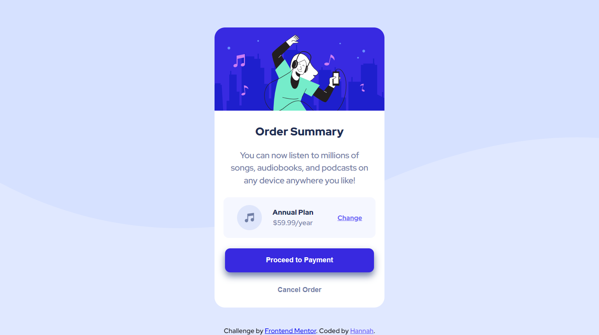

# Frontend Mentor - Order summary card solution

This is a solution to the [Order summary card challenge on Frontend Mentor](https://www.frontendmentor.io/challenges/order-summary-component-QlPmajDUj). Frontend Mentor challenges help you improve your coding skills by building realistic projects. 

## Table of contents

- [Overview](#overview)
  - [The challenge](#the-challenge)
  - [Screenshot](#screenshot)
  - [Links](#links)
- [My process](#my-process)
  - [Built with](#built-with)
  - [What I learned](#what-i-learned)
  - [Continued development](#continued-development)
  - [Useful resources](#useful-resources)
- [Author](#author)
- [Acknowledgments](#acknowledgments)

## Overview 

### The challenge 
Users should be able to:

- Build the order summary card as close to the design as possible
- See hover states for interactive elements

### Screenshot




### Links

- Solution URL: [Github respository](https://github.com/Hacampbe/order-summary-component-main#readme)
- Live Site URL: [Github Pages](https://hacampbe.github.io/order-summary-component-main/)

## My process

### Built with

- Semantic HTML5 markup
- CSS custom properties
- Flexbox
- Mobile-first workflow

### What I learned

This was the first project that I coded without following a tutorial. It helped me to consolidate the HTML and CSS knowledge that I've gained so far. At first, I struggled with the background image and centering/styling the card component, so it took me a few tries to get that down. I also had to remind myself how to use pseudoclasses and how to create a fixed footer. 

Finally, for the desktop-view media query, I used min-width: 1025px instead of 1440px because the latter was too large for my laptop. 

I enjoyed creating these buttons with the box-shadow, hover, and transitions.

```css
.payment-btn {
    background-color: hsl(245, 75%, 52%);
    padding: 15px 20px;
    color: white;
    border-radius: 10px;
    box-shadow: 0px 7px 13px 0px hsl(224deg 23% 55%);
```
```css
.payment-btn, .cancel-btn {
    border: none;
    font-weight: 700;
    transition: all 0.2s;
}
.payment-btn:hover {
    background-color: hsl(245, 90%, 66%);
}
.cancel-btn:hover {
    color: hsl(223, 47%, 23%);
}
```

### Continued development

One question I still have about my code is if I used enough semantic HTML. I used a lot of div tags, but maybe I should have used more semantic tags. I don't have a grasp on when I should use certain tags. 

I also need to better understand how to center blocks of text/images. I used flexbox to horizontally center my card component, but it wouldn't vertically center until I added min-height: 100vh and I do not know the reason.

### Useful resources

- [MDN Web Docs](https://developer.mozilla.org/en-US/) - I used this for various CSS properties.
- [W3Schools](https://www.w3schools.com/css/default.asp) - I used this for various CSS properties.
- [CSS Tricks](https://css-tricks.com/centering-css-complete-guide/) - This helped when I was trying to center the card component.

## Author

- Frontend Mentor - [@Hacampbe](https://www.frontendmentor.io/profile/Hacampbe)
- Twitter - [@hannah41943661](https://twitter.com/hannah41943661)

## Acknowledgments

I am currently taking Colt Steele's course on Udemy, "The Web Developer Bootcamp." I've acquired a great foundation so far from his tutorials that made me confident to do this project. 
